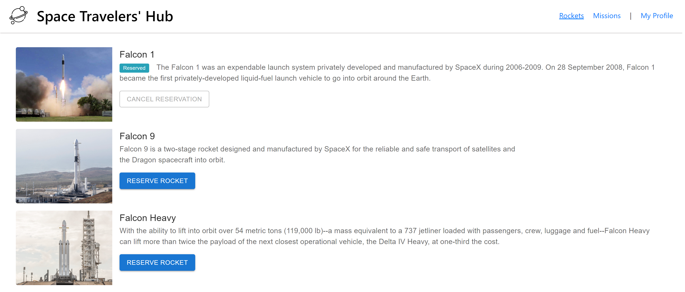

# Space Travelers' Hub

## Table of Contents

- [Table of Contents](#table-of-contents)
- [About Project](#about-project)
- [Live Demo - Netlify](#live-demo---netlify)
- [Built With](#built-with)
- [Getting Started](#getting-started)
- [API Interactions](#api-interactions)
- [Contributing](#contributing)
- [Authors](#authors)
- [Acknowledgements](#acknowledgements)
- [Show your support](#show-your-support)

## About Project

"Space Travelers' Hub" is a web application for a company that provides commercial and scientific space travel services. This application allows users to book rockets and join selected space missions.
This project uses [SpaceX API](https://documenter.getpostman.com/view/2025350/RWaEzAiG) which is an Open Source REST API for rocket, core, capsule, pad, and launch data, created and maintained by the developers of the r/SpaceX organization.



### [Live Demo - Netlify](https://61316b3b988a0259237471f3--relaxed-bell-daddf8.netlify.app/)

## Built With

- ReactJS
- Redux
- [SpaceX API](https://documenter.getpostman.com/view/2025350/RWaEzAiG)

## Getting Started

- Clone this repo <https://github.com/mugberto/space-travelers-hub>

    ```bash
    git clone https://github.com/mugberto/space-travelers-hub.git
    ```

- Navigate to space-travelers-hub folder/directory

    ```bash
    cd space-travelers-hub
    ```

- On the comandline, at the project's root, run ```npm install``` to install app dependencies

- Next, run ```npm start``` which will run the app in the development mode.

- Open [http://localhost:3000](http://localhost:3000) to view it in the browser.

- ALTERNATIVELY

  - Just run ```npm run build``` which will build the project and generate output files into the ```build``` directory.

  - Go to ```build``` directory and manually open ```index.html``` to interact with the app

- Run ```npm run test``` to run tests.

## API Interactions

From SpaceX API, this app/project is interacting/consuming the following endpoints:

- **Base URL** - <https://api.spacexdata.com/v3>
- **Fetching and Loading Missions - Method(GET)** - <https://api.spacexdata.com/v3/missions>
- **Fetching and Loading Rockets - Method(GET)** - <https://api.spacexdata.com/v3/rockets>

Take a look at the [DOCUMENTATION](https://documenter.getpostman.com/view/2025350/RWaEzAiG) for further insights.

## Contributing

Contributions, issues, and feature requests are welcome!

Feel free to check the [issues page](https://github.com/mugberto/space-travelers-hub/issues)

  1. Fork the Project
  2. Create your Feature Branch (`git checkout -b feature/newFeature`)
  3. Commit your Changes (`git commit -m 'Add some newFeature'`)
  4. Push to the Branch (`git push -u origin feature/newFeature`)
  5. Open a Pull Request

## Authors

👤 **Hubert Mugabo**

- GitHub: [@githubhandle](https://github.com/mugberto)
- Twitter: [@twitterhandle](https://twitter.com/mugberto)
- LinkedIn: [LinkedIn](https://www.linkedin.com/in/hubert-mugabo-23144b6a/)

👤 **Lameck Otieno**

- GitHub: [@githubhandle](https://github.com/Lameck1)
- Twitter: [@twitterhandle](https://twitter.com/lameck721)
- LinkedIn: [LinkedIn](https://www.linkedin.com/in/lameck-odhiambo-642b7077/)
- Portfolio: [Portfolio](https://lameck.me)

## Acknowledgements

- [ReactJS Organization](https://reactjs.org/) for the amazing [Documentation](https://reactjs.org/docs/getting-started.html) on React.
- [Redux Organization](https://redux.js.org/) for the amazing [Redux Essentials Tutorial](https://redux.js.org/tutorials/essentials/part-1-overview-concepts) on React.
- **Space X developers** for the amzing opensource API.

## Show your support

Give a ⭐️ if you like this project!
